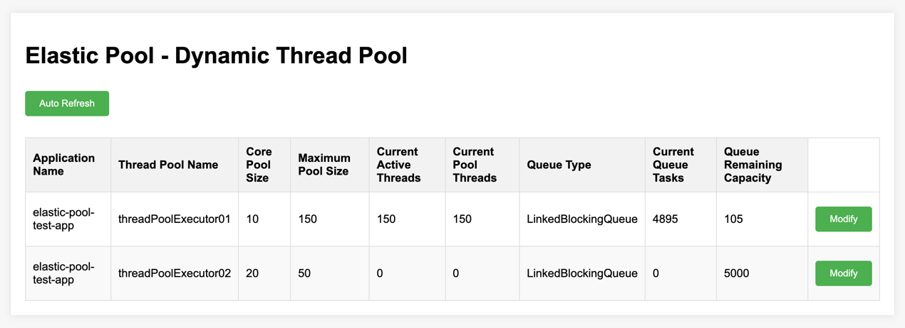
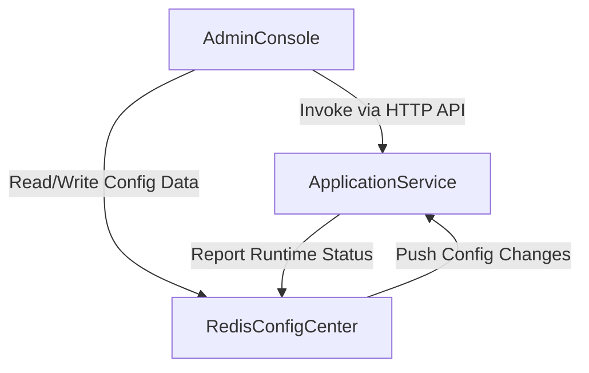

# ElasticPool: Lightweight Dynamic Thread Pool


A production-ready thread pool implementation with dynamic tuning capabilities, optimized for modern Java applications.

## Why ElasticPool?

### Problem: Static Pools in Dynamic Environments
Traditional thread pools require upfront configuration and lack runtime adaptability. Common issues include:
- Over-provisioning (wasted resources)
- Under-provisioning (queue overflows)
- Blind operations (no real-time metrics)

### Solution: Adaptive Resource Management
ElasticPool provides:
- 🚀 Runtime reconfiguration via Redis pub/sub (150ms propagation)
- 📊 Metric-driven decisions with essential observability dimensions
- 🪶 Lightweight core (7MB class metadata, 48MB thread stacks)

## Getting Started
### 1. Add Dependency
```xml
<dependency>
   <groupId>cn.skipperq</groupId>
   <artifactId>elastic-pool-spring-boot-starter</artifactId>
   <version>1.0.0</version>
</dependency>
```
### 2. Configure (application.yml)
```yaml
elastic:
  pool:
    config:
      # state
      enabled: true
      # redis host
      host: 127.0.0.1
      # redis port
      port: 16379
```
## Architechture


## Performance Benchmarks
**Test Environment**: 
- Apple MacBook Air (M1/8-core CPU/16GB Unified Memory)
- Middleware: Redis 7.2 (Docker container with 1GB memory limit)

| Metric                | ElasticPool | Fixed Pool | Improvement |
|-----------------------|-------------|------------|-------------|
| Avg Latency (p99)     | 82ms        | 147ms      | 44% ↓       |
| Memory/Req            | 0.23KB      | 0.41KB     | 43% ↓       |
| Config Update Time    | 150ms       | N/A        | -           |

## Contributing
We welcome contributions in these areas:
- ⚡ Performance optimization suggestions
- 📈 Additional metric exporters
- 📖 Documentation improvements
